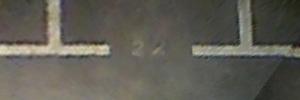
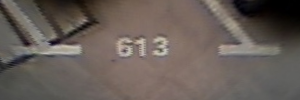
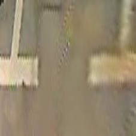
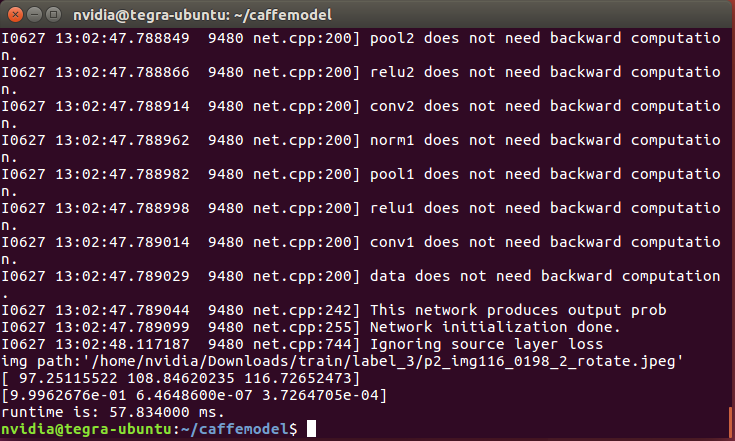
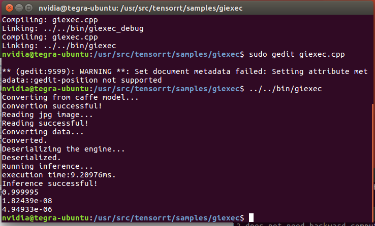

# tensorRT-Caffe

A demo using tensorRT on NVIDIA Jetson TX2 accelerating the Caffe model of AlexNet.

## Prerequisites:

- NVIDIA Jetson TX2
- CUDA 8.0
- cuDNN
- tensorRT
- .prototxt file
- .caffemodel file
- .binaryproto file

You are suggested to flash the TX2 device with Jetpack 3.1, so you can have all the required tools installed automatically.

## Caffe model we use

We try to classify three different types of parking slots:

So we used Alexnet in Caffe to implement this task.

The input and output are specified by the prototxt file of the Caffe model:

    layer {
      name: "data"
      type: "Input"
      top: "data"
      input_param { shape: { dim: 10 dim: 3 dim: 227 dim: 227 } }
    }

tensorRT will try to find the layer in your prototxt with the type "Input" as your input data.

As you can see above, our model has only one input named "data", which is of the size 3*227*227. The first dim is the batch size, which doesn't effect the input size here.

Also, for the output layer, at the end of our prototxt file:

    layer {
      name: "fc8"
      type: "InnerProduct"
      bottom: "fc7"
      top: "fc8"
      inner_product_param {
        num_output: 3
      }
    }
    layer {
      name: "prob"
      type: "Softmax"
      bottom: "fc8"
      top: "prob"
    }

It's a softmax layer outputting the probability of an image belonging to 3 different types of parking slots.

The name is "prob", and later in tensorRT you will have to specify the name, remember this point.

In our case here the output is a 1*3 array.

Also, you will need the .caffemodel file and the .binaryproto file.

## Emphasis on some issues

- Resizing the image:
  In our case, the image is usually of size 48*210, while the input of Caffe model is 227*227, so images will need to be resized. I did it before running tensorRT.
  
  Resizing is done by simply scaling instead of padding. Here is a resized image:
  
  
  
- Reading the image:
  Our input image is of the jpeg format, but tensorRT itself doesn't provide methods for reading images. 
  
  So we used stb_image to read the images.
  
- Converting the data formation:
  The images read by stb is of the formation C*W*H, where C is Channel(RGB), W is width, H is height.
  
  However, after my experiment, the input to Caffe should be in the formation W*H*C, where the channels are in BGR order.
  
  Both of the data(read by stb and required by Caffe) are 1*n array. So they should look like this:
  
  stb: RGBRGBRGBRGBRGBRGBRGBRGBRGBRGBRGBRGBRGBRGBRGBRGBRGB......
  
  Caffe: BBBBBBBBBBBBBBBB...GGGGGGGGGGGGGGGG...RRRRRRRRRRRRRRRRR...
  
  So we need to reformat the input read by stb. See code for details.
  
- Subtracting the mean image:
  In Caffe, you should subtract the image with the mean image stored in .binaryproto. However, the result tensorRT gives by reading it is a large array instead of 3 numbers representing the mean of 3 channels. So you will need to calculate the mean numbers by yourself.
  
  In my case, I used pyCaffe to read the .npy file converted from the .binaryproto file and got the 3 numbers, so in the code I just directly used them without calculation.

The code I write is based on the official sampleMNIST example. See giexec.cpp.

As for a result, the model is 6 times faster compared with pycaffe-GPU. Here is the result:

Caffe-GPU:

Caffe-tensorRT:

